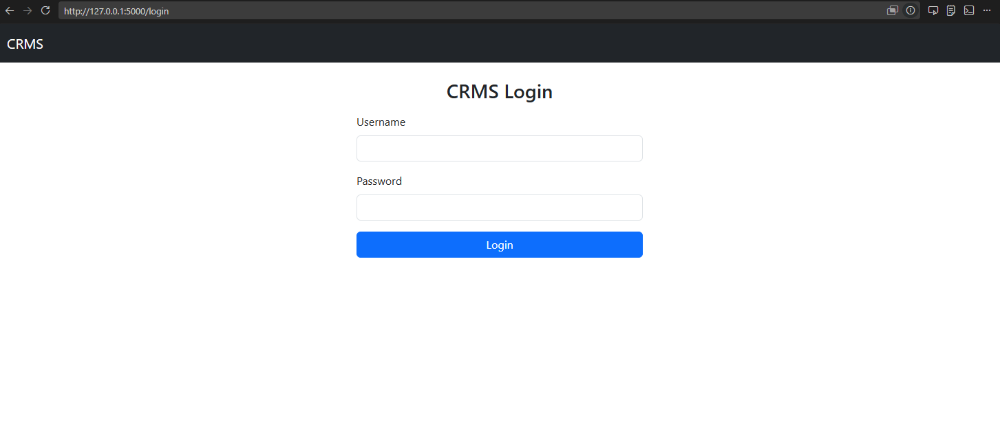
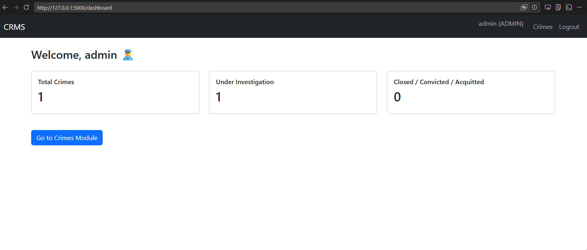
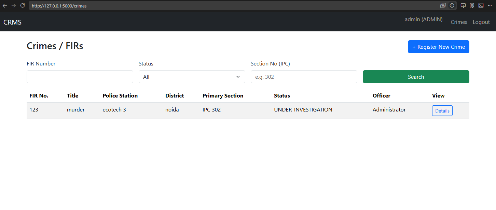
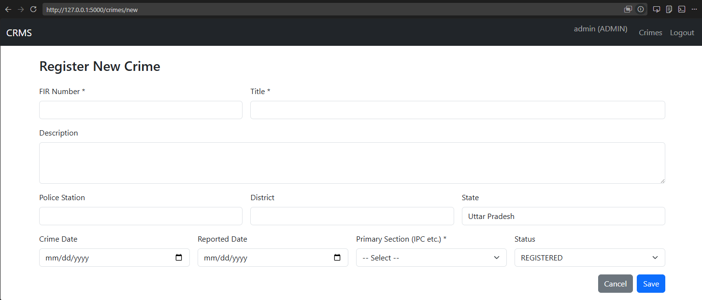

# Crime Record Management System (CRMS)

A full-stack web-based Crime Record Management System developed using **Python Flask** and **MySQL** for efficient crime record handling, FIR tracking, investigation management, and case monitoring.

The project includes authentication, dashboard analytics, role-based access, case management, and relational database integration through a responsive Flask web interface.

---

# Features

- Secure Admin Authentication
- FIR / Crime Registration
- Case Status Tracking
- Investigation Workflow Management
- Law Section Management
- Criminal & Person Records
- Dashboard Analytics
- Activity Logging
- MySQL Database Integration
- Responsive Web Interface

---

# Tech Stack

## Backend
- Python
- Flask

## Database
- MySQL

## Frontend
- HTML
- CSS
- Jinja2 Templates

## Libraries Used
- Flask
- mysql-connector-python
- passlib

---

# Project Structure

```bash
Crime-Record-Management-System/
│
├── screenshots/
│   ├── login.png
│   ├── dashboard.png
│   ├── crimes.png
│   └── details.png
│
├── templates/
├── app.py
├── config.py
├── requirements.txt
├── run_crms.bat
└── README.md
```

---

# Database Schema

The system uses multiple relational tables including:

- users
- crimes
- law_sections
- crime_sections
- persons
- case_person
- activity_log

The database schema is normalized for efficient querying and data integrity.

---

# Installation & Setup

## 1. Clone Repository

```bash
git clone https://github.com/hardikdixit123/Crime-Record-Management-System.git
cd Crime-Record-Management-System
```

---

## 2. Create Virtual Environment

```bash
python -m venv venv
```

Activate environment:

### Windows

```bash
venv\Scripts\activate
```

---

## 3. Install Dependencies

```bash
pip install -r requirements.txt
```

---

## 4. Configure MySQL

Create database:

```sql
CREATE DATABASE crms_db;
```

Update MySQL credentials inside:

```bash
config.py
```

Example:

```python
DB_CONFIG = {
    'host': 'localhost',
    'user': 'root',
    'password': 'YOUR_PASSWORD',
    'database': 'crms_db'
}
```

---

## 5. Run Application

```bash
python app.py
```

Open in browser:

```txt
http://127.0.0.1:5000
```

---

# Default Login

```txt
Username: admin
Password: admin123
```

---

# Screenshots

## Login Page



---

## Dashboard



---

## Crime Records



---

## Case Details



---

# Future Improvements

- Advanced Search & Filtering
- Crime Analytics Dashboard
- Role-Based Permissions
- PDF Report Export
- REST API Integration
- Cloud Deployment
- Real-time Notifications

---

# Resume Description

Developed a full-stack Crime Record Management System using Flask and MySQL featuring secure authentication, case tracking, activity logging, and database-driven CRUD operations with normalized relational schema design.

---

# Author

Hardik Dixit

GitHub:
https://github.com/hardikdixit123